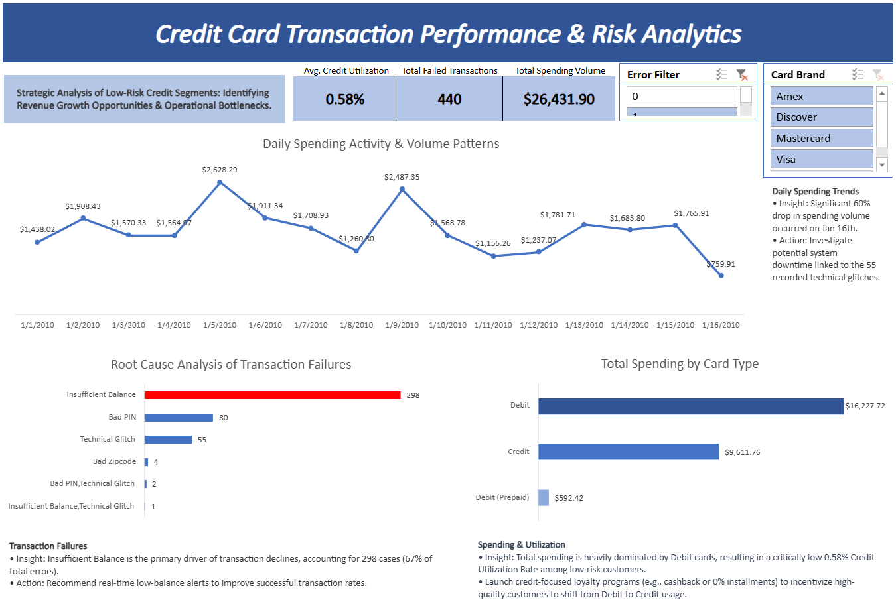

# 💳 Credit Card Transaction Evaluation & Risk-Value Identification

## 📖 Project Background
**Bank Nexus** (Fictional Entity) is a global financial services provider. This project focuses on a critical business challenge: high-quality, low-risk customers have a critically low credit utilization rate (**0.58%**), preferring debit cards for the majority of their transactions. 

As a Data Analyst, I performed a full-cycle analysis to identify technical bottlenecks and behavioral patterns. The goal is to provide data-driven strategies to convert debit volume into credit usage, thereby increasing bank revenue without increasing credit risk.

**Focus Areas:**
* **Operational Health:** Identifying root causes of transaction failures.
* **Customer Behavior:** Comparative analysis of Debit vs. Credit spending.
* **Strategic Growth:** Identifying conversion potential for low-risk segments.

### 🛠️ Quick Links
* **SQL Cleaning & ETL Script:** [View SQL Script](01_extraction_query.sql)
* **Interactive Excel Dashboard:** [View on Excel Web](https://1drv.ms/x/c/8479bc108aa6c48e/IQDozt9mrlaiRbmw09UghvMnAVjxEFDrtiWzXOfo8vrEQO4?e=oUKGtN)

---

## 📊 Data Structure & ETL Process
The raw data was distributed across three relational tables. I utilized **SQL** to perform the entire ETL process, transforming over **144,907 rows** of raw data into a unified, analysis-ready flat table.

**Technical Execution in SQL:**
* **Data Integration:** Executed optimized `LEFT JOIN` operations to merge **Transactions**, **Users**, and **Cards** tables.
* **Cleaning & Standardization:** Used `REPLACE` and `CAST` functions to convert string-based currency into `Decimal(18,2)` for precise calculations.
* **Advanced Pipeline:** Employed **Common Table Expressions (CTEs)** to maintain a modular and readable cleaning logic.
* **Strategic Filtering:** Applied business logic to focus exclusively on **Low-Risk segments** (Credit Score >= 700 & DTI < 0.4) and filtered out compromised card data (Dark Web security exclusion).

---

## 📑 Executive Summary

### Overview of Findings
Despite a healthy customer base, credit utilization is stagnant at **0.58%** due to a strong preference for Debit cards ($16,227 total spend). A significant operational finding revealed that on January 16th, transaction volume dropped by **60%** due to system glitches. Furthermore, **67%** of failures are caused by "Insufficient Balance," highlighting a gap in real-time customer communication.

---

## 🔍 Insights Deep Dive

### Category 1: Operational Efficiency & Root Cause Analysis
* **Primary Failure Driver:** "Insufficient Balance" accounts for **298 cases**, suggesting customers lack real-time visibility of their funds.
* **Technical Health:** **55 pure system glitches** were identified. While fewer in number, they correlate directly with major drops in daily spending volume.

### Category 2: Daily Spending Activity & Volume Patterns
* **The "Jan 16th" Anomaly:** Spending plummeted to **$759.91** from a peak of $2,628. 
* **Reliability Correlation:** This decline is perfectly aligned with the peak of technical glitches, proving that infrastructure stability is the primary driver of consistent revenue.

### Category 3: Total Spending by Card Type
* **Debit Dominance:** Total Debit spending ($16,227.72) is nearly double that of Credit ($9,611.76).
* **Conversion Potential:** Since these users are high-credit-score individuals, they represent a prime target for credit-focused loyalty incentives.

---

## 🚀 Recommendations
* **Real-time Liquidity Alerts:** Implement automated "Low Balance" push notifications to reduce transaction declines.
* **Credit Conversion Incentives:** Launch cashback or reward programs specifically for the Low-Risk segment to shift spend from Debit to Credit.
* **Infrastructure Audit:** Prioritize IT system stability to eliminate glitches that cause 60% revenue dips in a single day.

---

## ⚠️ Assumptions and Caveats
* **Filtered Scope:** Analysis is restricted to active, safe, and low-risk customer segments.
* **Currency:** All figures are in USD.
* **Security:** Compromised cards were excluded during the SQL processing phase.
